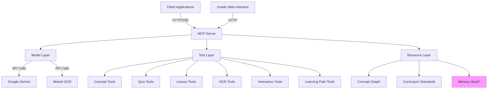
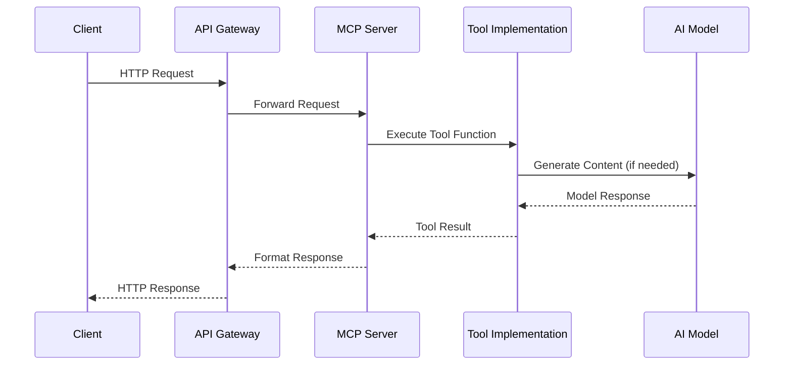
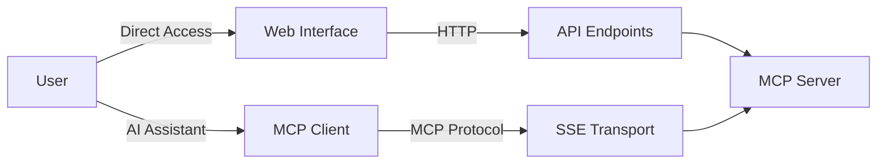
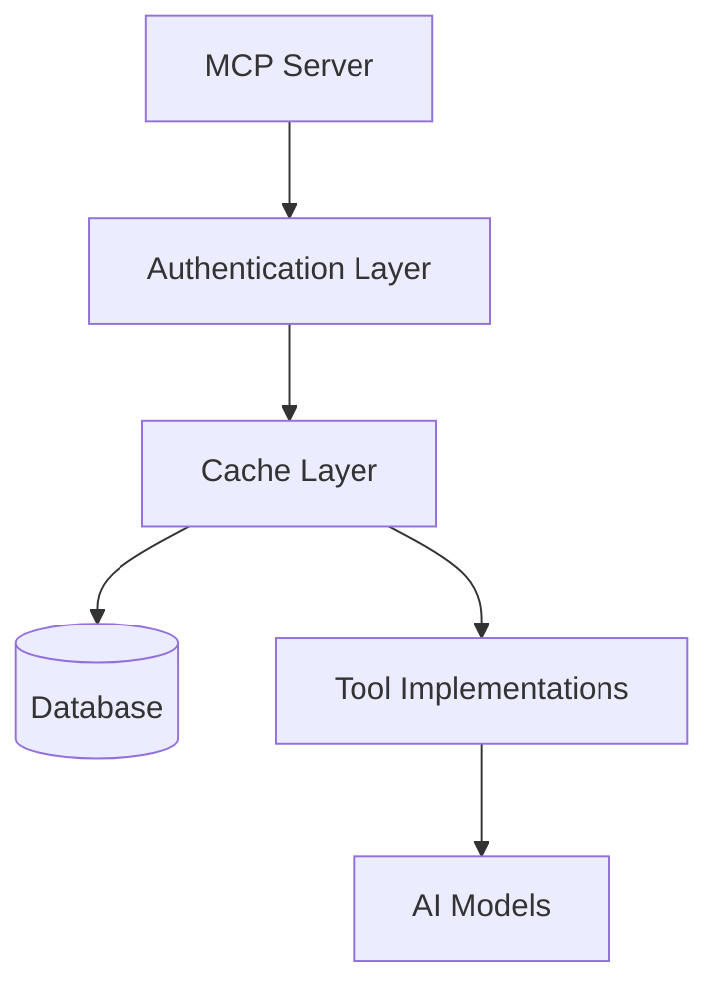

# TutorX-MCP Project Analysis

## Table of Contents
1. [Executive Summary](#executive-summary)
2. [Software Architecture Analysis](#software-architecture-analysis)
3. [Implementation Analysis](#implementation-analysis)
4. [Product Analysis](#product-analysis)
5. [Recommendations](#recommendations)
6. [Version History](#version-history)

## Executive Summary

TutorX-MCP is an advanced educational AI tutoring platform that leverages the Model Context Protocol (MCP) for tool integration and provides a comprehensive suite of educational features. The system follows a modern architecture with a clear separation of concerns between the MCP server, tool implementations, and user interfaces.

The project implements a range of features as described in the Product Requirements Document (PRD), including an adaptive learning engine, multi-modal interaction capabilities, assessment tools, and advanced features like document OCR and submission originality checking.

This analysis examines the project from three perspectives:
1. **Software Architecture**: Evaluating system design, component interactions, and architectural decisions
2. **Implementation**: Reviewing code quality, patterns, and technical choices
3. **Product**: Assessing feature completeness, user experience, and alignment with requirements

## Software Architecture Analysis

### System Architecture Overview



### Component Analysis

#### MCP Server
The MCP server is the core of the system, implemented using FastAPI and FastMCP. It handles HTTP requests, manages tool registration, and exposes endpoints for client applications. Key architectural aspects include:

1. **Shared MCP Instance**: The system uses a single shared MCP instance (`mcp_instance.py`) to avoid circular imports and ensure all tools are available to the running server.

2. **API Gateway**: The server acts as an API gateway, exposing HTTP endpoints for all core features.

3. **SSE Transport**: The server provides Server-Sent Events (SSE) transport for protocol-compliant client connections.



#### Tool Layer
Tools are implemented as async functions decorated with `@mcp.tool()` and organized by functionality in the `tools` directory. This modular design allows for easy extension and maintenance:

1. **Concept Tools**: Handle concept graph interactions and skill assessments
2. **Quiz Tools**: Generate educational quizzes based on concepts
3. **Lesson Tools**: Create complete lesson plans
4. **OCR Tools**: Process documents and extract text using Mistral OCR
5. **Interaction Tools**: Process student queries and check submission originality
6. **Learning Path Tools**: Generate personalized learning paths

#### Resource Layer
Resources are managed as in-memory data structures that provide access to educational content:

1. **Concept Graph**: Maintains relationships between educational concepts
2. **Curriculum Standards**: Stores educational standards for different countries
3. **Memory Bank**: Planned feature for persistent storage of student interactions

#### Model Layer
The system integrates with AI models through a well-designed abstraction layer:

1. **GeminiFlash Class**: Provides a unified interface to Google's Gemini models with automatic fallback from Gemini 2.0 to 1.5 when necessary.
2. **Mistral OCR Integration**: External OCR service for document processing.

### Architectural Patterns

The TutorX-MCP system implements several notable architectural patterns:

1. **Microservices Architecture**: The system is designed with modular components that can be independently deployed and scaled.

2. **API Gateway Pattern**: The MCP server functions as an API gateway, providing a unified entry point for clients.

3. **Decorator Pattern**: Used for tool registration through the `@mcp.tool()` decorator.

4. **Dependency Injection**: The shared MCP instance is injected into tool modules.

5. **Circuit Breaker Pattern**: The Gemini model implementation includes fallback mechanisms when the primary model fails.

### Strengths

1. **Modularity**: Clear separation of concerns with distinct modules for different responsibilities.
2. **Extensibility**: New tools can be easily added by creating new functions and registering them with the MCP instance.
3. **Error Handling**: Robust error handling and fallback mechanisms for external services.
4. **API-First Design**: All features are accessible via well-defined API endpoints.

### Areas for Improvement

1. **Memory Bank Implementation**: The memory bank feature is planned but not yet implemented, limiting stateful interactions.
2. **Resource Persistence**: Resources are currently in-memory, which limits scalability and persistence.
3. **Authentication & Authorization**: Limited security mechanisms for protecting sensitive endpoints.
4. **Testing Coverage**: While test infrastructure exists, more comprehensive test coverage would improve reliability.

## Implementation Analysis

### Code Organization

The project follows a well-structured organization:

```
tutorx-mcp/
├── main.py                  # MCP server entry point
├── app.py                   # Gradio web interface
├── run.py                   # Runner script for different modes
├── tests/                   # Test suite
├── mcp_server/              # Core server implementation
│   ├── server.py            # FastAPI application
│   ├── mcp_instance.py      # Shared MCP instance
│   ├── model/               # Model integration
│   ├── resources/           # Educational resources
│   └── tools/               # MCP tool implementations
└── docs/                    # Documentation
```

### Technology Stack

1. **Backend Framework**: FastAPI for high-performance API endpoints
2. **MCP Implementation**: FastMCP for Model Context Protocol support
3. **UI Framework**: Gradio for web interface
4. **AI Models**: Google Gemini 2.0 Flash with fallback to 1.5
5. **OCR Service**: Mistral OCR for document processing
6. **Testing**: Pytest and unittest for test automation

### Code Quality Assessment

#### Strengths
1. **Type Hints**: Consistent use of typing annotations for better IDE support and documentation
2. **Error Handling**: Comprehensive error catching and fallback mechanisms
3. **Code Organization**: Logical separation of concerns
4. **Documentation**: Detailed docstrings and comments

#### Areas for Improvement
1. **Model API Key Management**: Hard-coded API key in the code (`gemini_flash.py`)
2. **Consistent JSON Parsing**: Multiple implementations of JSON extraction methods across modules
3. **Test Coverage**: Some modules lack comprehensive tests

### Implementation Patterns

1. **Asynchronous Programming**: Consistent use of `async`/`await` for non-blocking operations
2. **Singleton Pattern**: Shared MCP instance as a singleton
3. **Factory Pattern**: For creating various educational resources
4. **Strategy Pattern**: For different model versions and fallback mechanisms

## Product Analysis

### Feature Completeness

The implemented features align well with the PRD requirements:

#### Core Features
✓ **Adaptive Learning Engine**: Implemented with concept graph and learning paths  
✓ **Multi-Modal Interaction**: Text processing and OCR integration  
✓ **Assessment Suite**: Quiz generation and originality checking  
✓ **Feedback System**: Contextual analysis of student submissions  

#### Advanced Features
✓ **Cross-Institutional Knowledge Fusion**: Curriculum standards for multiple countries  
✓ **Automated Lesson Authoring**: Lesson generation based on topic and grade level  
⚠️ **Neurological Engagement Monitor**: Not fully implemented  

### User Experience Analysis

The platform provides multiple access methods:
1. **MCP Client Access**: Through the MCP protocol for AI assistants
2. **Web Interface**: Through Gradio for direct user interaction



### Alignment with Target Users

The system caters well to the three primary user groups:

1. **Students**: Through personalized learning paths and multi-modal interaction
2. **Teachers**: Through assessment tools and curriculum alignment
3. **Administrators**: Through curriculum standards integration

### Market Positioning

TutorX-MCP positions itself as a comprehensive educational platform with these unique selling points:
1. **AI-Powered Adaptivity**: Personalized learning based on student needs
2. **Multi-Modal Interaction**: Supporting various input methods
3. **MCP Integration**: Enabling use within AI assistants
4. **Cross-Standard Support**: Accommodating different educational systems

## Recommendations

### Architectural Recommendations

1. **Implement Memory Bank**: Complete the planned Memory Bank feature for persistent storage of student interactions and learning progress.

2. **Database Integration**: Move from in-memory resources to a proper database for the concept graph and curriculum standards.

3. **Authentication Layer**: Add proper authentication and authorization mechanisms to protect sensitive endpoints.

4. **Resource Caching**: Implement a caching strategy for frequently accessed resources.



### Implementation Recommendations

1. **Credential Management**: Move API keys to environment variables or a secure credential store.

2. **Common Utilities**: Create a shared utilities module for common functions like JSON parsing.

3. **Enhanced Testing**: Increase test coverage, especially for critical paths.

4. **CI/CD Pipeline**: Set up continuous integration and deployment processes.

### Product Recommendations

1. **Complete Multi-Modal Support**: Add voice recognition capability to complement text and OCR.

2. **User Dashboard**: Implement the custom dashboard described in the PRD.

3. **Access Control**: Add role-based access control for different user types.

4. **Metrics Collection**: Implement logging and metrics to track system usage and performance.

## Version History

### v0.1.0 (Initial Release) - June 2025
- Implemented core MCP server with tool registration
- Added concept graph and curriculum standards resources
- Integrated Google Gemini Flash models with fallback mechanism
- Implemented basic tools (concept, quiz, lesson generation)
- Added Mistral OCR integration for document processing
- Created basic test suite with unittest and pytest

### v0.2.0 (Planned) - July 2025
- Memory Bank implementation for persistent storage
- Enhanced multi-modal support with voice recognition
- Improved test coverage and CI/CD pipeline
- User dashboard implementation
- Role-based access control
