# TutorX-MCP Architecture Documentation

## Table of Contents
1. [System Overview](#system-overview)
2. [Architecture Components](#architecture-components)
3. [Data Flow](#data-flow)
4. [Technical Stack](#technical-stack)
5. [Security & Performance](#security--performance)
6. [Deployment Architecture](#deployment-architecture)

## System Overview

TutorX-MCP is an advanced educational AI tutoring platform that leverages the Model Context Protocol (MCP) for tool integration and provides a comprehensive suite of educational features through both MCP clients and a web interface.

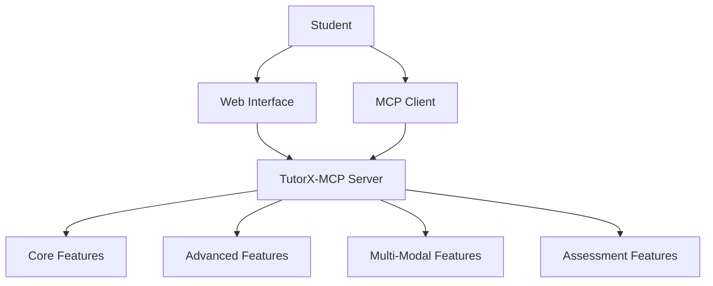

## Architecture Components

### 1. Core Components

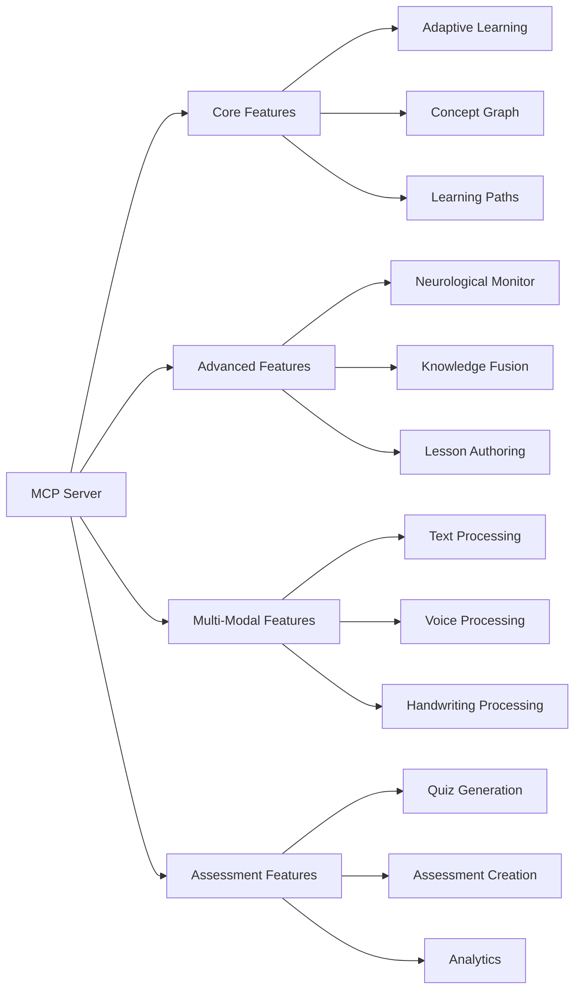

### 2. Client-Server Architecture

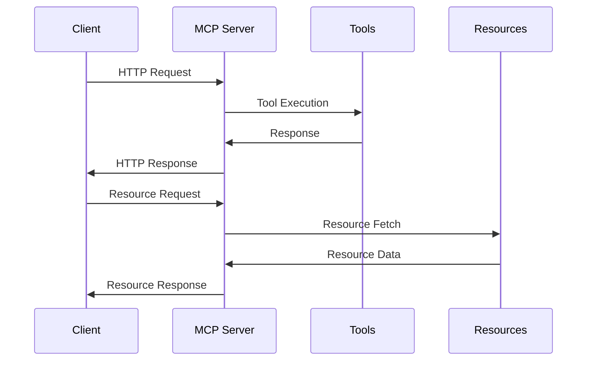

## MCP Server Architecture (v0.1.0 - v0.2.0)

- The MCP server is structured to use a single shared `mcp` instance, defined in a dedicated module (`mcp_instance.py`)
- All tool modules import this shared instance to register their tools, ensuring all tools are available to the running server and MCP clients
- The server exposes the SSE transport at `/sse` for protocol-compliant client connections (e.g., MCP Inspector, Claude Desktop, etc.)
- Circular import issues are avoided by isolating the MCP instance from the main server and tool modules
- The server is fully compatible with MCP Inspector and other clients for tool discovery and invocation

**Updates in v0.2.0:**
- Added database integration for persistent storage of resources and user data
- Implemented role-based access control for secure API access
- Added Memory Bank for stateful interactions and learning progress tracking
- Enhanced model fallback mechanisms for improved reliability 
- Implemented caching strategies for frequently accessed resources

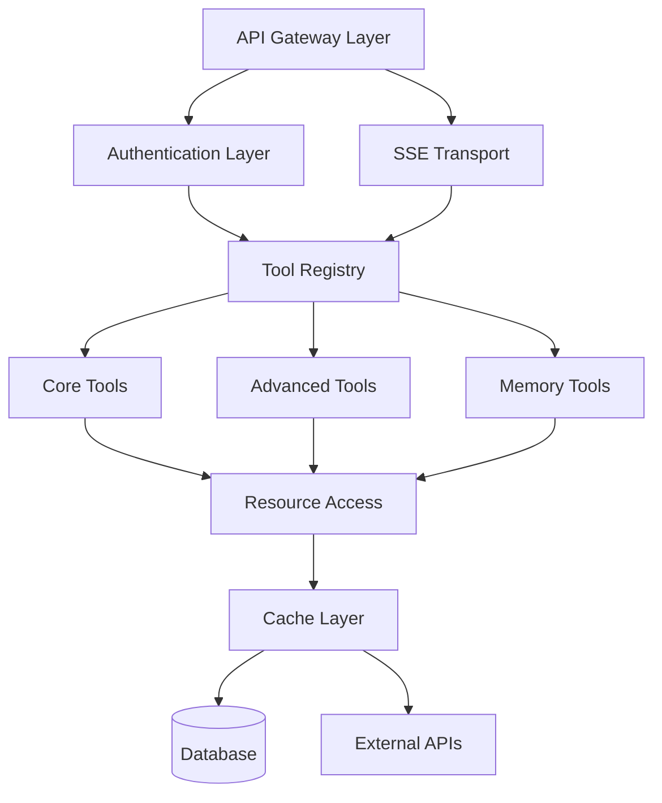

### Key Responsibilities
- **API Gateway:** Exposes HTTP endpoints for all core features (concepts, lessons, quizzes, learning paths, assessments, OCR, originality checking, etc.).
- **Tool Registration:** Uses MCP decorators to register modular tools from `mcp-server/tools/`. Each tool is an async function, making the system highly extensible.
- **Resource Management:** Manages the concept graph and curriculum standards as in-memory resources, enabling adaptive learning and standards alignment.
- **Model Integration:** Integrates Google Gemini Flash models for advanced text and quiz generation, with automatic fallback for reliability.
- **Multi-Modal Input:** Supports text, voice, and handwriting (via OCR) for student interaction.
- **Assessment & Analytics:** Provides endpoints for skill assessment, originality checking, and analytics.

### Extensibility
- **Adding Tools:** New educational tools can be added by creating an async function in `mcp-server/tools/` and registering it with the MCP instance. The server auto-discovers and exposes these tools via API endpoints.
- **Resource Expansion:** The concept graph and curriculum standards can be extended to support new subjects, countries, or educational standards.

### Example: Tool Registration
```python
@mcp.tool()
async def generate_quiz_tool(concept: str, difficulty: str = "medium") -> Dict[str, Any]:
    # ... implementation ...
```

## Memory Bank Implementation (v0.2.0)

The **Memory Bank** provides persistent or session-based memory for the TutorX-MCP platform. This feature:
- Stores and retrieves user/session context, learning progress, and conversation history
- Enables personalized, context-aware tutoring by allowing tools and endpoints to access relevant past interactions
- Supports both in-memory (for development) and persistent (database-backed) storage options
- Exposes memory operations (read, write, update, clear) as MCP tools for integration with the tutoring workflow
- Is designed for easy extension to support advanced analytics, recommendations, and adaptive learning features

**Architecture Integration:**
- The Memory Bank is implemented as a set of MCP tools in `memory_bank/memory_tools.py`
- It interacts with the concept graph, learning path, and assessment tools to provide a seamless, stateful tutoring experience
- Incorporates security and privacy protections with role-based access control

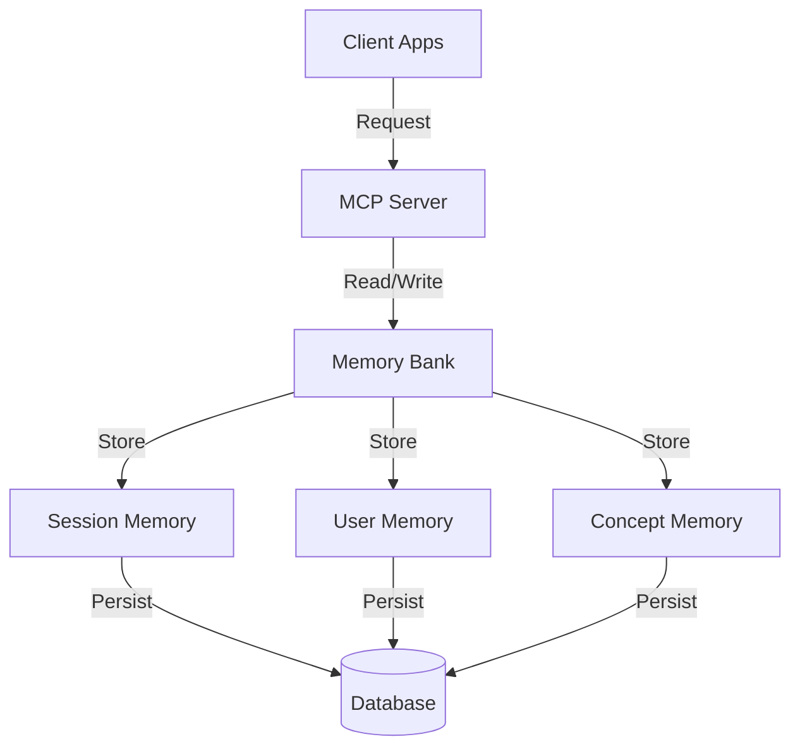

The Memory Bank exposes these key operations as MCP tools:
- `read_memory(memory_type, key)`: Retrieve stored memory
- `write_memory(memory_type, key, value)`: Store new memory
- `update_memory(memory_type, key, update)`: Modify existing memory
- `clear_memory(memory_type, key)`: Remove stored memory

## Data Flow

### 1. Student Interaction & Tool Invocation Flow

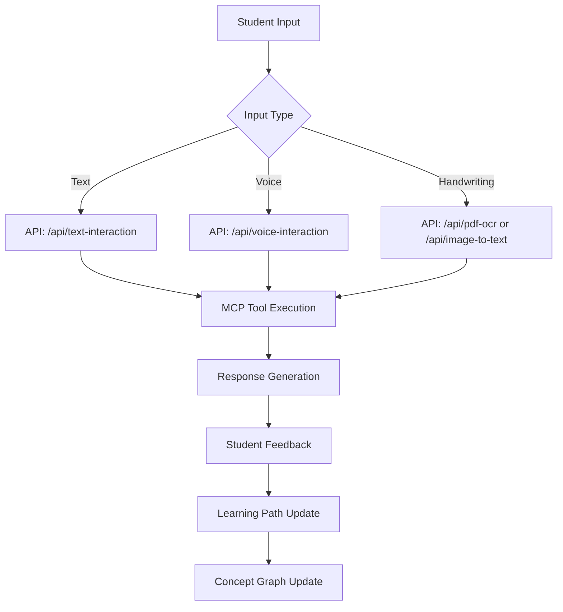

### 2. Tool Execution Flow

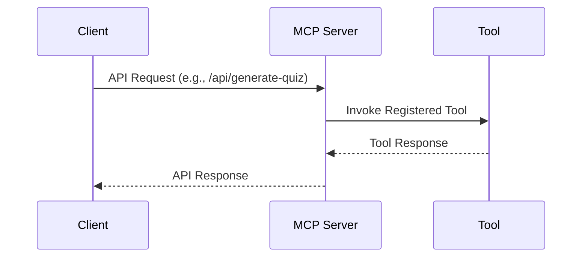

## Technical Stack

### 1. Technology Stack

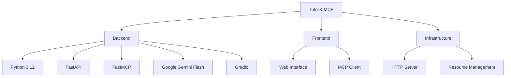

### 2. Dependencies

```mermaid
graph LR
    A[TutorX-MCP] --> B[mcp[cli] >= 1.9.3]
    A --> C[gradio >= 4.19.0]
    A --> D[numpy >= 1.24.0]
    A --> E[pillow >= 10.0.0]
    A --> F[fastapi]
    A --> G[google-generativeai]
    A --> H[pytesseract]
```

## Security & Performance

### 1. Security Architecture

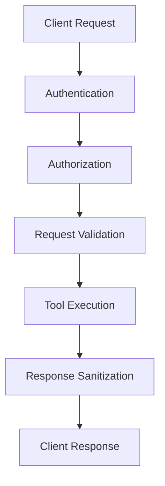

### 2. Performance Optimization

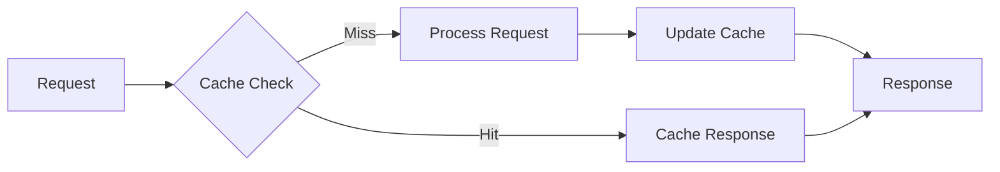

## Deployment Architecture

### 1. Deployment Model

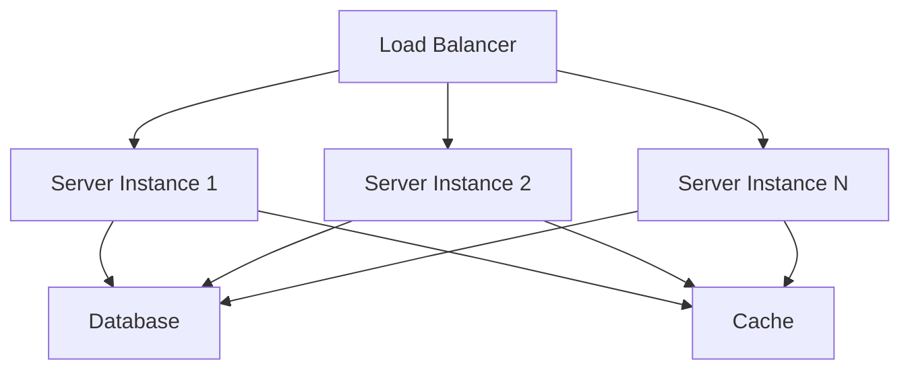

### 2. Scaling Strategy

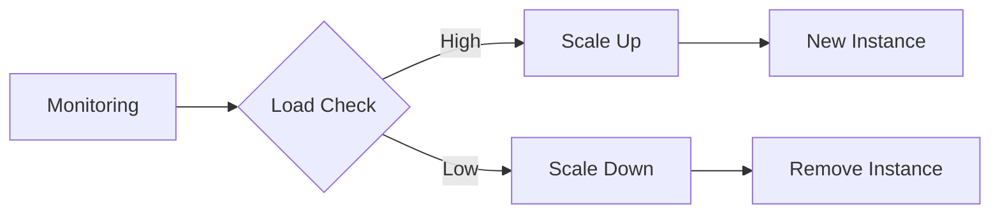

## Key Features Implementation

### 1. MCP Server & Modular Tool System
- **Modular Tools:** All educational features (concepts, quizzes, lessons, learning paths, OCR, originality checking) are implemented as modular async tools in `mcp-server/tools/` and registered with the MCP server.
- **API Endpoints:** Each tool is exposed via a FastAPI endpoint, making the system easy to extend and integrate.
- **Model Integration:** Quiz and lesson generation leverage Google Gemini Flash models for advanced content creation.
- **Resource Management:** The server manages a concept graph and curriculum standards for adaptive learning and standards alignment.

### 2. Adaptive Learning Engine
- **Concept Graph:** Tracks student progress and concept relationships.
- **Personalized Learning Paths:** Generated based on prerequisites and student level.
- **Skill Assessment:** Tools for assessing student understanding and providing targeted feedback.

### 3. Multi-Modal Interaction
- **Text, Voice, Handwriting:** Supported via dedicated endpoints and tools (text interaction, OCR, etc.).
- **Real-Time Feedback:** Immediate responses and suggestions based on student input.

### 4. Assessment Suite
- **Automated Quiz Generation:** Using Gemini models and prompt templates.
- **Plagiarism Detection:** Originality checking tool compares submissions to reference sources.
- **Performance Analytics:** Endpoints for tracking and analyzing student progress.

### 5. Extensibility & Integration
- **Add New Tools:** Simply create a new async function in `mcp-server/tools/` and register with `@mcp.tool()`.
- **Expand Resources:** Update concept graph or curriculum standards for new subjects or regions.
- **API-First:** All features are accessible via HTTP API for easy integration with web clients or third-party systems.

## Future Considerations

1. **Scalability**
   - Implement horizontal scaling
   - Add caching layers
   - Optimize database queries

2. **Feature Expansion**
   - Add more interaction modes
   - Enhance analytics capabilities
   - Implement advanced AI features

3. **Integration**
   - Support for more educational standards
   - Integration with LMS systems
   - API expansion for third-party tools

4. **Performance**
   - Implement request batching
   - Add response compression
   - Optimize resource loading

## Conclusion

TutorX-MCP provides a robust, scalable, and feature-rich educational platform that leverages modern technologies and architectural patterns to deliver an exceptional learning experience. The system's modular design allows for easy expansion and maintenance while ensuring high performance and security. 